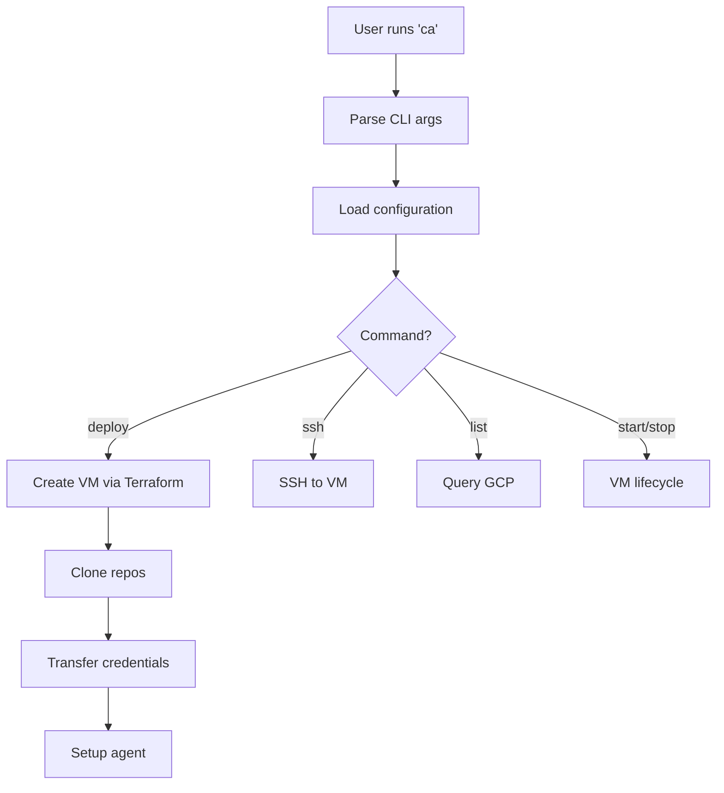
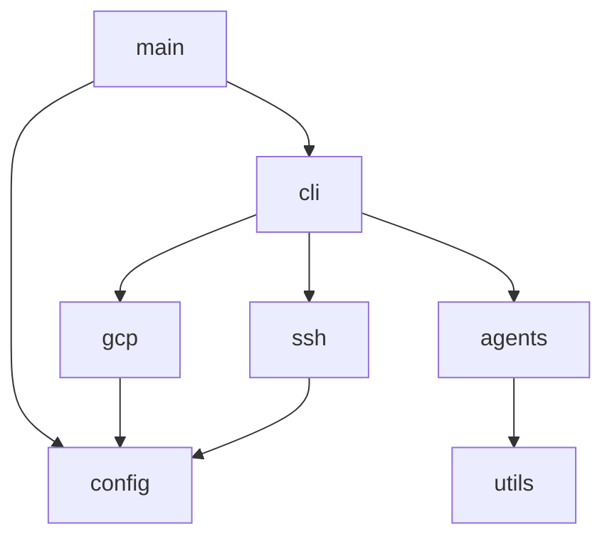

# Architecture

Overview of Cloud Agent's architecture and design decisions.

## High-Level Flow



## Components

### CLI (`cli.rs`)

Handles command-line argument parsing using `clap`.

- Defines all commands and options
- Validates input
- Dispatches to appropriate handlers

### Configuration (`config.rs`)

Manages runtime configuration:

- Environment variables
- GCP settings
- User detection
- VM naming

### GCP Operations (`gcp.rs`)

Handles all GCP/Terraform operations:

- VM creation/deletion
- Terraform apply/destroy
- Resource queries

### SSH Client (`ssh.rs`)

Wraps SSH operations:

- Command execution
- File transfer (SCP)
- Tmux session management

### Git Operations (`git.rs`)

Handles Git-related functionality:

- Repository URL parsing
- Clone operations
- Remote detection

### Agents (`agents/`)

Pluggable agent system:

- `Agent` trait defines interface
- Each agent in separate file
- `AgentManager` handles dispatch

## Design Decisions

### Why Rust?

1. **Performance**: Fast startup, low memory
2. **Safety**: Catch errors at compile time
3. **Cross-platform**: Single binary, no runtime
4. **Maintainability**: Strong typing, clear structure

### Why Terraform?

1. **Declarative**: Define desired state
2. **Idempotent**: Safe to re-run
3. **State management**: Tracks resources
4. **Extensible**: Many providers available

### Why Tmux?

1. **Persistence**: Sessions survive disconnects
2. **Multiplexing**: Multiple windows/panes
3. **Familiar**: Standard tool for remote work

## Module Dependencies



## Error Handling Strategy

1. **Use `Result<T>`** for all fallible operations
2. **Context with `anyhow`** for error messages
3. **Graceful degradation** where possible
4. **Clear user messaging** for common errors

```rust
use anyhow::{Result, Context};

fn deploy_vm() -> Result<()> {
    terraform_apply()
        .context("Failed to create VM")?;
    clone_repos()
        .context("Failed to clone repositories")?;
    Ok(())
}
```

## Testing Strategy

### Unit Tests

Located alongside code in `#[cfg(test)]` modules:

```rust
#[cfg(test)]
mod tests {
    use super::*;

    #[test]
    fn test_parse_repo_url() {
        // ...
    }
}
```

### Integration Tests

Located in `tests/`:

- `integration_test.rs` - CLI integration tests
- `unit_test.rs` - Cross-module tests

## Future Considerations

- **Multiple cloud providers**: AWS, Azure support
- **Plugin system**: External agent plugins
- **Web UI**: Browser-based management
- **API server**: Remote management API

